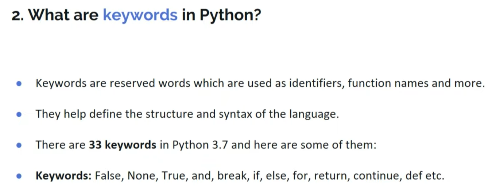
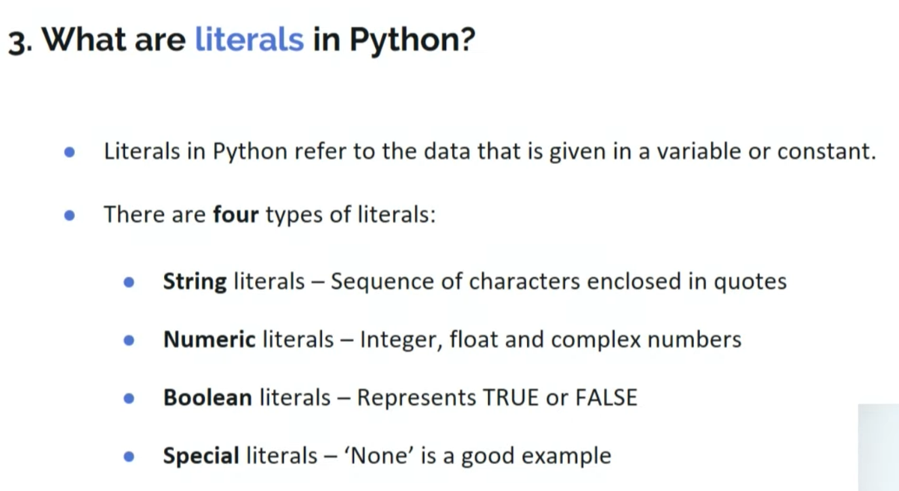
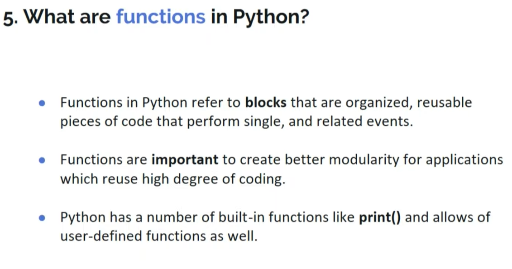
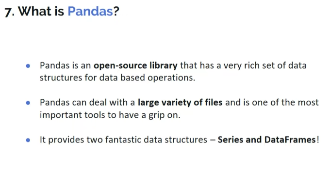
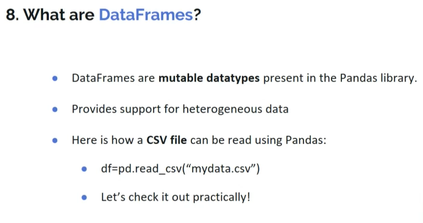
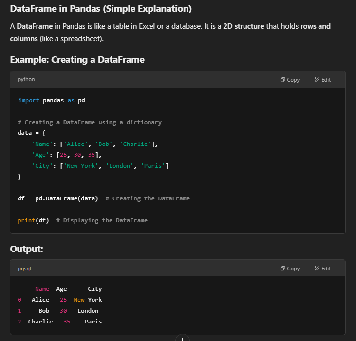
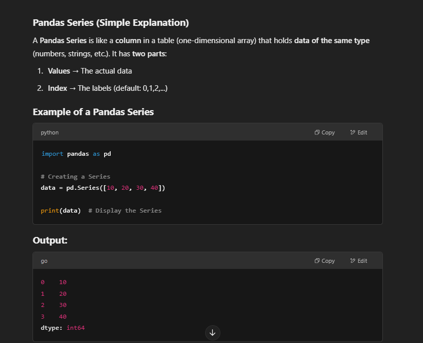
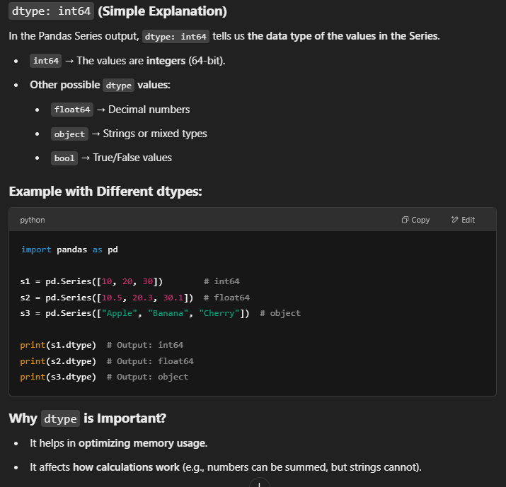
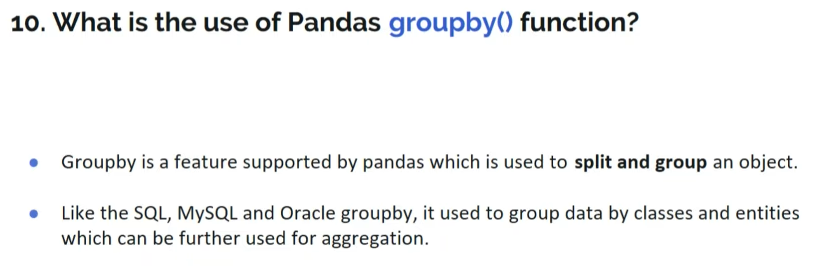

<!-- what are the key features of python -->

<!-- what are keyword in python -->

<!-- what are literals in python -->

<!-- How can ypu concatenate two tuples -->

t1 = (1,"abc",True)
t2 = (2,4,7)
print(t1 + t2)

<!-- what are functions in python -->

example:
<!--  -->
    def greet(name):
    return f"Hello, {name}!"

    # Calling the function
    print(greet("Yamini"))

<!--  -->

<!-- How can you initialze a 5x5 NumPy array with only zeros? -->

import numpy as np
n1 = np.zeros((5,5))
print(n1)

<!-- o/p: -->

[[0 0 0 0 0]
[0 0 0 0 0]
[0 0 0 0 0]
[0 0 0 0 0]
[0 0 0 0 0]]

<!-- what is Pandas? -->

<!-- what are DataFrames -->

with example:
 

<!-- what is csv file? -->
A CSV (Comma-Separated Values) file is a plain text file that stores data in a tabular format (rows and columns), where values are separated by commas. It is commonly used for storing and exchanging data between different applications like Excel, databases, and Python.

<!-- eg: -->
Name,Age,City
Alice,25,New York
Bob,30,London
Charlie,35,Paris

<!-- it can stored as like: -->
     Name  Age      City
0   Alice   25  New York
1     Bob   30   London
2  Charlie   35    Paris

<!-- program: -->

import pandas as pd
df = pd.read_csv("data.csv")  # Reading the CSV file
print(df)  # Displaying the content

<!-- what is Pandas Series -->

<!-- what is dtype in output? -->

<!-- what is the use of Pandas groupby() function? -->

